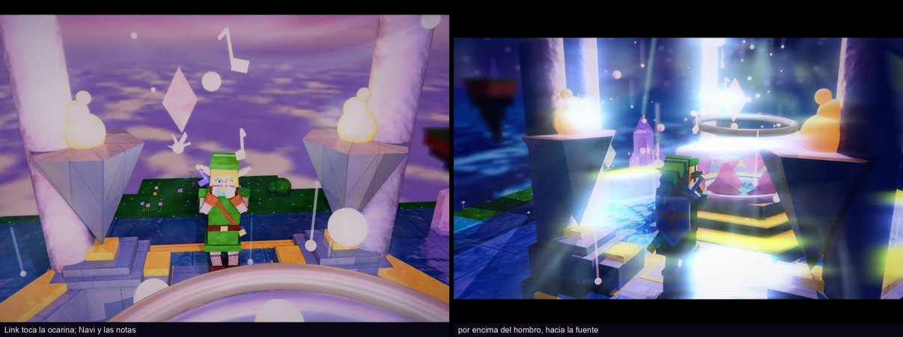

# Great Fairy Fountain — un diorama trazado con rayos

Un trazador de rayos en tiempo real, escrito desde cero en Rust, que dibuja la
Gran Fuente de las Hadas de *Ocarina of Time* sobre una **isla flotante** y la
anima con el **Great Fairy's Fountain Theme**. Como en el juego: todo de
baldosa blanca celeste, una **piscina hexagonal**, la **Trifuerza incrustada en
el piso** donde Link se para a tocar, un estrado en terrazas con el cuenco del
hada dentro de una flor de loto, dos **antorchas de cono** con fuego naranja, y
una **lluvia de brillos** cayendo alrededor de la fuente.

Parado sobre la Trifuerza, **Link** —hecho de cubos— toca la Ocarina del
Tiempo mientras **Navi** le da vueltas a la cabeza. Cuando entran las voces, la
**Gran Hada** sale del cuenco dando una voltereta entre halos de luz, baila en
el aire, **bendice a Link** con dos haces dorados que bajan de sus manos a las de él
para recibir el poder, se zambulle, y en el golpe siguiente Link estrena el
**Fuego de Din**. Todo bajo una **aurora boreal** que se retuerce, pulsa y
cambia de color con la canción.

No hay motor 3D: la geometría, la iluminación, las sombras, los reflejos, el
modelo de Link y el cielo son código propio. Lo único que aporta raylib es la
ventana, el audio y la capacidad de correr shaders de fragmentos.

Las únicas dependencias son `raylib` (ventana, entrada, audio, shaders),
`rayon` (repartir las filas entre hilos) e `image` (leer y escribir PNG).
Ni matemática de vectores, ni intersecciones, ni BVH, ni sombreado.

## Video

**[▶ Ver el video completo (docs/fuente_de_las_hadas.mp4)](docs/fuente_de_las_hadas.mp4)**
— la canción entera, en **1440×1080** (1080p), grabada con `--video` (59 MB; la versión en
alta calidad, de 268 MB, se regenera con el mismo comando y no va al repo).

[](docs/fuente_de_las_hadas.mp4)

---

## Correrlo

Hace falta [Rust](https://rustup.rs). El mp3 y el análisis ya vienen en el repo.

```bash
cargo run --release
```

Tiene que correrse desde la raíz del proyecto: las rutas de las texturas, los
shaders y la música son relativas a ahí.

### Controles

| | |
|---|---|
| `espacio` | play / pausa |
| `←` `→` o `A` `D` | girar alrededor de la isla |
| `↑` `↓` o `W` `S` | subir y bajar la cámara |
| `Q` `E` o `PgUp` `PgDn` | acercar y alejar |
| ratón | arrastrar para orbitar, rueda para acercar |
| `X` | antialiasing 2×2 (cuadruplica el costo) |
| `T` | antialiasing temporal (gratis, viene encendido) |
| `F` | guardar una foto del cuadro en pantalla |
| `H` | mostrar u ocultar la ayuda |

La cámara da vueltas sola alrededor de la isla siguiendo un programa de planos
que marca la canción (ver más abajo); las teclas y el ratón se **suman** a ese
recorrido en vez de reemplazarlo.

### Otros modos

```bash
cargo run --release -- --video docs/fuente_de_las_hadas.mp4   # graba el video (pide ffmpeg)
cargo run --release -- --foto 95      # traza ese segundo con todo el post-procesado y lo guarda
cargo run --release -- --bench        # mide cinco momentos y vuelca el trazado crudo
cargo run --release -- --sync 20      # imprime, segundo a segundo, lo que el análisis le pide a la escena
cargo run --release -- --taa          # banco de pruebas del antialiasing temporal
cargo run --release -- --sin-taa      # apagarlo, para compararlo
```

El video no corre en tiempo real: cada cuadro se traza **en alta definición de
verdad, a 1440×1080**, con dos muestras por píxel (`VIDEO_MUESTRAS` lo cambia),
y pasa por el mismo post-procesado que en vivo, pero con toda la cadena de la
GPU trabajando a 1440×1080 y escribiendo en un buffer propio en vez de en la
ventana de 800×600: nada se estira. El tiempo lo pone el número de cuadro, así
que sale a 30 fps exactos.
`VIDEO_DESDE` y `VIDEO_HASTA` recortan un tramo, `BENCH_T=46,96,136` elige qué
segundos mide `--bench`, y `CAMARA=x,y,z,mx,my,mz` fija la cámara en `--foto`.

---

## Lo que pide la consigna

| | |
|---|---|
| **Escena compleja** | Isla flotante de bloques con cascadas, cristales colgantes, islotes, flores, arbustos, cristalitos y pasto que cuelga por los bordes; la fuente de Ocarina con piscina hexagonal, pasillo, Trifuerza en el piso, estrado hexagonal en terrazas, flor de loto, antorchas de cono, seis columnas y techo; tres halos toroidales; Link articulado de ~50 cubos con cinemática inversa; la Gran Hada articulada; Navi; notas; haces de cristal; los haces de la bendición; el Fuego de Din; lluvia de 150 brillos; ~50 hadas y motas; rupias; skybox con aurora y mar de nubes. 264 objetos, 12 luces de color. |
| **Rotación y zoom** | La cámara orbita 360° alrededor de la isla (una vuelta cada 96 s) y se acerca y aleja con el programa de planos; teclado y ratón suman giro, altura y distancia. |
| **Materiales** (cada uno con su textura y sus pesos de albedo, especular, reflexión y transparencia) | Ver la tabla de abajo: son más de diez. |
| **Refracción** | El agua de la piscina y de las cascadas (1.33), los cristales (1.5), las rupias (1.6). Con Fresnel: el agua es espejo mirada de costado y transparente mirada de frente. |
| **Reflexión** | El agua, el mármol pulido de la plaza, la obsidiana del cuenco, el oro, las baldosas, la ocarina esmaltada, el escudo. Con reflejos rugosos donde el material no es espejo. |
| **Skybox** | Equirectangular generado por código al arrancar: estrellas que titilan, nebulosa, luna, y encima, calculado por rayo, la aurora (con olas, color y corona que siguen a la música), el mar de nubes, las estrellas fugaces y el amanecer. |

### Los materiales

Los cuatro pesos del albedo son `[difuso, especular, reflexión, transparencia]`.

| Material | Textura | Albedo | Especular | Índice de refracción |
|---|---|---|---|---|
| Mármol de hada (bordes) | `fairy_marble.png` + relieve | `[1.0, 0.22, 0.10, 0.0]` | 18 | — |
| Mármol perlado (columnas, techo) | pintado por código: lavanda con vetas rosas y celestes | `[0.85, 0.12, 0.04, 0.0]` | 30 | — |
| Mármol pulido (plaza) | `fairy_marble.png` + relieve | `[0.9, 0.6, 0.30, 0.0]` | 80 | — |
| Agua (celeste, como en Ocarina) | `water_fairy.png`, desplazándose | `[0.25, 0.3, 0.5, 0.6]` | 120 | 1.33 |
| Oro (molduras) | `gold_triforce.png` + relieve | `[1.0, 0.95, 0.35, 0.0]` | 95 | — |
| Obsidiana (fondo del cuenco) | `obsidian.png` + relieve | `[1.0, 0.7, 0.6, 0.0]` | 200 | — |
| Baldosa blanca (pasillo, bordes, estrado, antorchas) | pintada por código | `[0.55, 0.30, 0.12, 0.0]` | 50 | — |
| Pétalo de loto | pintado por código | `[1.0, 0.45, 0.10, 0.0]` | 50 | — |
| Cristal | `crystal.png` | `[0.35, 0.9, 0.25, 0.7]` | 120 | 1.5 |
| Piedra de la isla | `stone_cave.png` + relieve | `[1.0, 0.05, 0.0, 0.0]` | 6 | — |
| Pasto | pintada por código | `[1.0, 0.06, 0.0, 0.0]` | 10 | — |
| Tierra | pintada por código | `[1.0, 0.04, 0.0, 0.0]` | 8 | — |
| Cascada | `water_fairy.png`, cayendo | `[0.35, 0.5, 0.25, 0.45]` | 90 | 1.33 |
| Rupia | color | `[0.3, 1.0, 0.3, 0.55]` | 180 | 1.6 |
| Túnica de Link | tela pintada por código | `[1.0, 0.08, 0.0, 0.0]` | 12 | — |
| Escudo hyliano | pintado por código | `[1.0, 0.7, 0.25, 0.0]` | 60 | — |
| Ocarina del Tiempo | esmalte azul | `[0.7, 1.0, 0.35, 0.0]` | 140 | — |
| Traje de la Gran Hada | hojas pintadas por código | `[1.0, 0.15, 0.0, 0.0]` | 18 | — |

---

## La escena

### La isla


La fuente flota sobre un mar de nubes. La isla sale de una grilla de celdas,
capa por capa: cada capa incluye las celdas que caen dentro de un radio que se
achica con la profundidad, deformado por ruido, y en cada fila las celdas
contiguas se funden en una sola caja. Pasto arriba, tierra debajo y roca que se
angosta en escalones hacia abajo: de costado se lee como un bloque de pasto de
Minecraft. De dos bordes caen cascadas de agua de verdad (refractan, y su
textura corre hacia abajo en cada cuadro), de la panza cuelgan puntas de
cristal encendido y alrededor flotan islotes más chicos que dan escala.

### La fuente de Ocarina

En el juego todas las fuentes son iguales: dos antorchas, el estanque al fondo y
la Trifuerza tallada en el piso delante; ahí se para Link, toca la canción de
Zelda y el hada sale en una cascada de luz, entre risas. La de acá
(`src/fuente.rs`) sigue a la de la versión de N64: todo de **baldosa de mármol
blanco celeste**, una **piscina hexagonal** de agua celeste con las seis
columnas naciendo de sus esquinas, un pasillo que entra hasta la **plataforma
cuadrada de la Trifuerza** (de oro, incrustada en el piso dentro de su marco, y
late con cada golpe), un **estrado hexagonal en terrazas** con filetes de oro,
y a los costados de Link las **dos antorchas de cono invertido** con su fuego
naranja. El cuenco del hada nace de una **flor de loto** (como en las fuentes
de estilo egipcio de la versión de 3DS), y alrededor del estrado cae una
**lluvia de brillos**: ciento cincuenta gotas de luz con su estela que
titilan, más encendidas cuanto más toca el arpa.

Los hexágonos salen de cubos sin un triángulo: tres cajas iguales, de ancho la
distancia entre lados opuestos y de largo el lado, giradas 60 grados entre sí,
se superponen exactamente en el hexágono. El agua usa un límite hexagonal
propio (`Limite::Hexagono`).

### Link



Link adulto de *Ocarina of Time*, hecho de **cubos que se pueden girar**
(`src/caja_orientada.rs`: en vez de girar la caja se gira el rayo, se resuelve
el test de las tres losas en el sistema de la caja y la normal vuelve al mundo
con los mismos ejes). Túnica, gorro largo, orejas de hylian, pelo rubio,
guanteletes, botas, el escudo hyliano y la Espada Maestra cruzados en la
espalda, y la Ocarina del Tiempo en la boca. La cara, la tela, el cuero y el
escudo son texturas pintadas píxel por píxel por código al arrancar.

Tiene **esqueleto**: raíz en los pies, cadera, torso, cabeza y un gorro que es
una cadena de cinco eslabones colgando de la coronilla, así que girar el torso
arrastra todo lo que cuelga de él. Brazos y piernas se resuelven con
**cinemática inversa de dos huesos**: las manos quedan siempre sobre la ocarina
y los pies siempre en el piso, aunque la cadera baje. La pose sale de la canción
en cada cuadro: se mece a la mitad del compás, marca cada tiempo doblando las
rodillas, gira el torso a contratiempo de la cadera, asiente, respira, y el
gorro llega tarde a cada movimiento, como tela. Y no hace lo mismo toda la
canción, sino que tiene **actos**: al principio toca tranquilo, con la cabeza
gacha sobre la ocarina; desde el segundo 40 toca con sentimiento, pasando el
peso de un pie al otro cada dos compases y echándose atrás en las notas
largas; desde el 90, cuando el tema crece, marca más con las rodillas y sigue
a Navi con la mirada; cuando sale el hada **baja la ocarina** y la mira,
asombrado; y en la coda vuelve a tocar, suave, hasta que al final baja la
ocarina y mira el cielo.
Cuando el hada lo bendice, **guarda la ocarina, levanta los dos brazos y mira
hacia arriba** para recibir el poder, como en la cinemática.

**Navi** revolotea alrededor de su cabeza con una luz propia que se mueve sobre
la túnica y el escudo, y cada ataque del arpa suelta una **nota** de la ocarina
que sube en espiral hacia la fuente, con los colores de los botones A (azul) y
C (amarillo) del juego.

### La Gran Hada

En el juego, cuando Link toca la canción frente a la fuente, el Hada Mayor sale
del agua girando entre risas, le da un poder y se va. Acá pasa en el clímax, en
cuatro tiempos (`src/hada_mayor.rs`):

1. **Sale del cuenco dando una voltereta** mientras gira, chica, dentro de la
   columna de luz, con un estallido de chispas y un anillo enorme en el agua;
   crece mientras sube y queda flotando derecha sobre el estrado.
2. **Baila a su aire** (ver abajo): se ríe con la mano en la boca y los
   hombros sacudiéndose, como en el juego, le tiende la mano a Link, junta las
   manos para reunir el poder.
3. **Bendice a Link**: abre los brazos en cruz y avanza por encima de él. En
   cada mano se enciende una esfera de luz y de **cada mano baja un haz
   dorado** —núcleo fino y halo ancho, respirando— hasta la mano levantada de
   Link del mismo lado; las chispas bajan por los haces girando en espiral.
   Los haces siguen a las manos durante toda la coreografía (la cruz, el
   aleteo, las manos ofrecidas). Link guarda la ocarina y levanta los brazos
   bajo una luz dorada.
4. **Se zambulle** girando en el cuenco, con una salpicadura de chispas, y en el
   primer tiempo fuerte siguiente Link lanza el **Fuego de Din**
   (`src/fuego_de_din.rs`), como en el juego: sobre el cuenco aparece el
   cristal en rombo girando, Link se agacha (las rodillas se doblan con
   cinemática inversa), levanta los puños y golpea el piso; en ese instante
   el rombo cae al cuenco y desde el centro de la fuente se abre una cúpula
   de luz pastel —durazno por fuera, rosa por dentro, casi transparente— que
   crece hasta envolver a Link y se deshace en dos ondas de chispas.

Está hecha igual que Link, con cubos orientados colgados de huesos, y copiada
de una captura del juego: **piel verde amarillenta y pálida**, **pelo rojo
carmesí** en **tres coletas** de cinco eslabones que se aclaran hacia la punta
como una llama, con un **flequillo en pico** sobre la frente y mechones largos
a los costados, **orejas en punta**, y **hiedra** —tallos verde oscuro con
hojitas amarillas, pintados por código— enredada en el pelo, los brazos y el
corpiño, que como en el juego es casi piel. La cara, igual que la del juego:
ojos grandes mirando de reojo con el iris violeta, **sombra roja** muy marcada
hasta unas cejas rojas y gruesas, labios morados sonriendo y la barbilla en
punta (la cabeza es un cubo: la punta se hace con sombra en las esquinas). La
piel brilla apenas: es un ser de luz.

Baila **a su aire, no al compás** (el compás lo marca Link): tiene una
coreografía de diez movimientos contada desde que sale del agua —brazos
arriba, la risa del juego con la mano en la boca, le tiende la mano a Link,
junta las manos, la cruz, aletea como alas, le ofrece las manos, pasa el poder
con una mano al cielo— que se funden uno en otro en un segundo. Entre
movimiento y movimiento las manos, la cabeza y la deriva en ocho siguen
periodos lentos que no coinciden entre sí, así que nunca repite el mismo gesto. El
cuerpo se arma de pie en su propio sistema y se lleva al mundo con una escala y
una rotación, así que el mismo modelo sirve para la figura chica que sale del
agua y para la grande que bendice.

Cuándo pasa lo decide el análisis: se buscan los **tramos** donde las voces se
sostienen (el promedio del swell en cuatro segundos pasa de 0.3), uniendo cortes
de menos de seis segundos y descartando los de menos de ocho. Cada tramo es una
sola salida, una bendición y una zambullida; siguiendo el swell directamente,
el hada entraba y salía del agua con cada respiro de las voces.

Mientras el hada está afuera, los **tres halos toroidales** —que el resto del
tema flotan horizontales sobre el cuenco como un círculo de invocación— suben por
la columna de luz y la rodean a la altura de los pies, la cintura y el pecho.

### El arco: empieza al amanecer y termina de noche

El tema abre con el cielo rosa y oro sobre las nubes y la fuente apenas
visible. Sobre la mitad del tema el día se escurre —las estrellas aparecen, el
ambiente pasa de durazno a violeta, el sol se enfría hasta quedar en luna—
mientras las luces de la fuente **suben**. El clímax cae en noche cerrada, y
sobre la coda el horizonte se vuelve a encender y engancha con el arranque.

Todo eso cuelga de **un solo número**, `luz_del_dia`, que vale 1 al alba y 0 de
noche.

### El golpe


- **Anillos de luz en el agua**: en cada tiempo sale del pie del altar un
  anillo rosa que se abre hasta el borde de la piscina, iluminado y levantando
  el agua a su paso (una loma gaussiana que tuerce el reflejo). El uno del
  compás pega entero y los otros tres a un tercio, y la fuerza sigue a la
  energía del tema: un susurro en la intro, olas de luz en el coro.
- **La columna de luz**: cuando las voces se sostienen (el clímax), sube del
  cuenco al cielo una columna con núcleo blanco y halo rosa translúcido, como
  cuando aparece el Hada Mayor, y late con el golpe.
- **Los haces de los cristales**: en cada primer tiempo de compás uno de los
  cuatro cristales de las esquinas dispara un haz de luz hacia lo alto, sobre
  la fuente, y se enciende entero; en el compás siguiente dispara el próximo,
  así la luz da la vuelta a la isla al ritmo del tema.
- **La aurora boreal** asoma desde el atardecer y las voces la llevan a pleno.
  Son dos cortinas con el borde de abajo nítido y la cola deshilachada hacia
  arriba, rayos verticales que se corren solos y pliegues, y además **toca la
  canción**: cada nota del arpa manda una ola de brillo que corre por la
  cortina hacia los dos lados; su **color sigue a los acordes** (cada familia
  armónica tiene su paleta: verde, azul, rosa, lima); en cada golpe la cortina
  se **estira** hacia arriba; en cada tiempo sube un **pulso** de brillo del
  filo a la cima; la cortina se **retuerce en pliegues** que se mueven solos y
  sus rayos **titilan**; un **resplandor** difuso enciende el cielo alrededor;
  con las voces aparece una **tercera cortina alta rojo-magenta** y la aurora
  deja de tener un lado apagado para llenar el cielo entero; y en el clímax
  converge en una **corona boreal** de rayos hacia el cenit. Se refleja en el
  agua y en el mármol, tiñe las nubes y le da un tinte a la luz ambiente de la
  isla.
- Además: la ocarina se enciende con cada nota, Navi late, los anillos
  toroidales destellan, las hadas se deshacen con el arpa, estrellas fugaces y
  estelas cruzan en los tiempos fuertes, y el bloom, la niebla y los haces de
  luz respiran con la canción.

### La cámara

Un programa de planos que sigue la canción: abre **lejos y alta**, un plano
general de la isla sobre las nubes; baja y se acerca a medida que la música
crece; en el segundo 45 y en el 96 se va a **planos de Link** (de frente, con
la cara y la ocarina, y por encima del hombro, con la fuente delante), que caen
justo donde la vuelta de la órbita pone la cámara del lado correcto; antes del
clímax da un giro de más para llegar del lado de Link y ahí frena la vuelta:
queda en **contrapicado**, de frente a la Gran Hada; para la bendición baja
detrás de Link y mira hacia arriba, al hada sobre él; y con la coda vuelve a
abrirse. Entre plano y plano interpola con Catmull-Rom, así que pasa por ellos
con velocidad en vez de frenar. En cada cambio de sección del tema la cámara
se **adelanta un paso** y vuelve: la estructura de la canción se ve en el
encuadre.

### ¿La escena responde en todo momento?

`--sync` lo mide: por cuadro toma la reacción más fuerte de la escena a la
canción (el golpe, un ataque del arpa, el haz de un cristal, las voces, la
bendición, el hechizo) y dice qué parte del tema queda por debajo de un umbral
y cuál es el hueco quieto más largo. Salvo la coda, donde el tema se apaga en
silencio, no hay ningún tramo de más de un segundo y medio en el que no esté
pasando algo al ritmo de la música. También lista los momentos del hada:
sale a los 124.9 s, bendice a los 134.1, se zambulle a los 152.1 y el Fuego de
Din cae a los 152.5.

---

## Cómo está hecho

### El trazado

- La aritmética de vectores es propia (`src/vec3.rs`): `Vec3`, producto
  punto, producto cruz, normalización y los operadores. Sin librería de
  álgebra lineal — en un trazador de rayos eso es justamente la parte que
  hay que mostrar.
- Cuboides, **cubos orientados**, cilindros, planos recortados, esferas,
  triángulos y **toros**.
- El **toro** (`src/toro.rs`) es la única figura que no se resuelve con una
  cuadrática: sustituyendo el rayo en su ecuación implícita queda una
  **cuártica**, que se resuelve por Ferrari (deprimir, cúbica resolvente,
  dos cuadráticas) en `f64`, porque en `f32` los rayos rasantes se pierden y
  el anillo hierve. Tres de ellos son los halos de invocación de la fuente.
  Antes de la cuártica, dos descartes baratos: la esfera que envuelve al
  anillo y la **losa** de su plano, que para un anillo acostado ahorra la
  cuártica a casi todos los rayos que pasan por encima o por debajo.
- Materiales con textura, mapa de relieve, reflexión y refracción con
  **Fresnel** (aproximación de Schlick) y sombras translúcidas: el agua y el
  cristal dejan pasar parte de la luz, así que el fondo de la piscina se
  ilumina a través del agua.
- **Luz propia por punto**: un impacto puede tener luz propia independiente de
  su material (los anillos del golpe en el agua).
- **Velos**: lo que es transparente del todo y no desvía (la cúpula del Fuego
  de Din, los haces, el halo de la columna) suma su luz y informa la
  profundidad de lo que deja ver, para que la niebla y el desenfoque del
  post-procesado no lo traten como una pared.
- **Skybox equirectangular generado por código**. Lo fijo (degradé,
  nebulosa, estrellas, luna) se hornea una vez; el **mar de nubes** también,
  evaluando el ruido en el punto donde cada dirección corta un plano de nubes
  muy por debajo de la isla, que es lo que les da perspectiva, pero su color
  se decide por rayo según la hora y la aurora. La aurora, las estrellas
  fugaces y el amanecer se calculan por rayo.
- **BVH** construido con la heurística de área, **rearmado en cada cuadro**
  con las cajas de ese instante, y un **BVH propio adentro de cada grupo
  estático** (la isla, el techo, la piscina). El árbol de sombras va aparte y
  solo lleva lo que puede tapar la luz.
- Los rayos se podan por contribución acumulada, no por profundidad: un camino
  que ya no puede cambiar ni un nivel de 255 no se sigue.
- **Oclusión ambiental** con dos rayos por impacto en el hemisferio
  ponderado por el coseno, con el largo de cada rayo sorteado (eso da la
  caída con la distancia gratis).
- **Reflejos rugosos**: el rayo reflejado se desvía según la rugosidad del
  material, y el acumulador temporal promedia.
- **Antialiasing temporal** con reproyección y recorte de vecindad.

### El post-procesado (GLSL 330, en luz lineal)

- **Bloom por cadena de seis mips**, el método de *Call of Duty: Advanced
  Warfare*: filtro de 13 muestras al bajar, carpa de 3×3 al subir.
- Curva de tono **AgX**, que sube al blanco sin torcer el tono de los colores
  saturados, que es todo el problema en una escena de rosas y cianes.
- Niebla cuadrática por profundidad (que deja casi limpio al cielo, para que
  no lave la aurora), god rays.
- Profundidad de campo, estelas anamórficas, aberración cromática, viñeta,
  grano y cierre a formato ancho.
- **CAS** (realce adaptativo por contraste) para recuperar el filo que pierde
  el estirado del cuadro trazado a la pantalla, junto con el reescalado
  bicúbico.

### La sincronización

`analizar_audio.py` saca bandas de frecuencia, onsets, beats, secciones y
chroma a 30 fps y los deja en un JSON. El trazador lo lee al arrancar y lo
indexa por tiempo; no sabe que existe librosa. Todo lo que se mueve es
**función del segundo de la canción**, no un estado que avanza cuadro a
cuadro: el mismo segundo da siempre la misma imagen, se dibuje a 5 o a 40
cuadros por segundo.

### Las texturas


Las de la fuente son procedurales, 512×512, generadas por
`generar_texturas_cueva.py` con NumPy y semilla fija. Las de la isla (pasto,
tierra) y las de Link (cara, tela, cuero, pelo, escudo hyliano) se pintan en
Rust al arrancar, píxel por píxel, con `TextureImage::pintada`.

```bash
python3 generar_texturas_cueva.py            # regenerar las texturas
python3 analizar_audio.py assets/music/fairy_fountain.mp3 \
    --salida fairy_fountain_sync.json        # regenerar el análisis (pide librosa)
```

---

## Rendimiento

Medido en un MacBook Air M3, trazando a 400×300 y estirando a 800×600 (la
resolución de antes; ver abajo por qué ahora es 560×420), con `--bench` (el
mínimo de cinco pasadas por momento):

| | antes | ahora |
|---|---|---|
| Trazado, media de los cinco momentos | 36.6 ms (27 fps) | **24 ms (41 fps)** |
| Peor plano | 44 ms (segundo 160) | ~44 ms (la bendición, de cerca) |
| El Fuego de Din (cúpula sobre toda la fuente) | — | 37 ms |

Y eso con la escena **casi ocho veces más grande** (de 34 a 264 objetos, de 8 a 12
luces). Las notebooks sin ventilador varían un 30% según la temperatura, así
que las decisiones se tomaron **contando instrucciones ejecutadas**
(`/usr/bin/time -l`), que no dependen del calor. Con el perfilador de macOS
(`sample`) se encontraron tres cosas:

1. **El árbol se armaba una sola vez**, y todo lo que se mueve tenía que
   declarar una caja que cubriera su recorrido entero: las estelas del arpa
   llevaban cajas de dieciséis unidades de lado y ningún rayo que pasara cerca
   de la fuente podía descartarlas. Recorrer el árbol era más de la mitad del
   cuadro. Ahora se rearma en cada cuadro (un centenar de cajas, microsegundos)
   y cada grupo que se mueve ajusta su caja a donde quedó: **−15%**.
2. **Los reflejos débiles no preguntan por la sombra.** Un rebote que llega al
   píxel con menos del 35% de peso (el reflejo borroso del piso) ilumina su
   impacto sin tirar rayos de sombra; los rebotes fuertes (el agua de
   costado, la obsidiana) la siguen calculando. La diferencia no se ve y era
   la quinta parte del cuadro: **−14%**.
3. **Grupos estáticos con árbol propio** y **una caja por hada y por mota**:
   las motas de polvo estaban en cuatro cajas de seis por cinco unidades, y
   cualquier rayo que cruzara la fuente probaba sus quince esferas. **−7%**.
4. Y para lo que se sumó después: Link y la Gran Hada van **partidos en grupos
   por parte del cuerpo** (un rayo que pasa por la cabeza no prueba las
   botas), el toro descarta con la **losa** de su plano antes de resolver la
   cuártica, y las estelas de la lluvia son **cubos alineados a los ejes**:
   con cilindros orientados la lluvia costaba el 9% del cuadro, con cubos
   casi nada.

### La CPU y la GPU a la vez

Medido el cuadro ENTERO en vivo (`PERFIL=1` imprime el desglose), el trazado
era 17 ms de 27: los otros 7 ms eran la GPU haciendo el post-procesado y
mostrando el cuadro, con la CPU esperando sin hacer nada. Ahora, en vivo, el
trazado del cuadro siguiente corre en otro hilo (que reparte las filas entre
todos los núcleos) **mientras** el hilo principal le pasa a la GPU el cuadro
anterior; el costo es un cuadro de retraso en pantalla. El cuadro entero bajó
de ~27 ms a **~21 ms**, y esa ganancia se gastó en **definición**:

- El trazado subió de 400×300 a **560×420** (casi el doble de píxeles).
- La ventana **se ajusta a la pantalla** (el 4:3 más grande que entra; en una
  MacBook Air de 13" queda en 896×672) y todo el post-procesado trabaja a los
  **píxeles reales** de la pantalla: en una retina son el doble de los puntos.
  Antes la cadena de la GPU iba a 800×600 y la última pasada se estiraba al
  doble, así que todo se veía blando aunque el trazado fuera bueno.
- El cuadro trazado se agranda con un **reescalado bicúbico** (Catmull-Rom,
  nueve lecturas en la GPU) en vez del bilineal de siempre, y el realce CAS
  ahora mide a sus vecinos a un texel del cuadro trazado (medía a un píxel de
  pantalla, que con el cuadro estirado tres veces caía casi en el mismo lugar
  y no realzaba nada).

Con todo eso el cuadro entero quedaba en ~35 ms (28 por segundo), que se
sentía lento. La última pieza es el **trazado en tablero de ajedrez**
(checkerboard rendering, la técnica del PS4 Pro): cada cuadro se traza solo
la mitad de los píxeles, alternando como un tablero, y la otra mitad la
completa el acumulador temporal con el cuadro anterior reproyectado, donde
esos píxeles SÍ se trazaron. Los que no tienen historia (lo que recién
aparece) se rellenan con el par de vecinos que corre a lo largo del borde, no
el que lo cruza, para que las columnas no queden en zigzag. La mitad de los
rayos por casi la misma imagen: el cuadro baja de ~36 ms a **~21 ms (46 por
segundo)** sin perder definición. `SIN_TABLERO=1` lo apaga y `SIN_PARALELO=1`
apaga el paralelismo, para comparar.

Un detalle que costó encontrar: la primera versión era el **doble de lenta**.
En macOS un hilo nace con la prioridad del que lo crea, y el grupo de hilos de
`rayon` se creaba recién la primera vez que se trazaba, o sea desde el hilo
del trazado, con menos prioridad: el sistema los mandaba a los núcleos de
eficiencia. Crearlo al arrancar, desde el hilo principal, lo arregló.

La palanca grande sigue siendo la resolución de trazado (`RENDER_W` /
`RENDER_H` en `src/main.rs`), no el post-procesado: el bloom, la niebla y el
resto corren en la GPU y cuestan casi lo mismo a cualquier resolución.

---

## Música

`assets/music/fairy_fountain.mp3` es el **Great Fairy's Fountain Theme** de
*The Legend of Zelda 25th Anniversary Soundtrack*. Los derechos son de
Nintendo; está acá solo para que el proyecto se pueda correr tal cual. *The
Legend of Zelda*, Link, Navi y la Trifuerza son de Nintendo; este es un
trabajo de facultad sin fines de lucro.

Si el archivo no está, la escena corre igual con un reloj interno.
