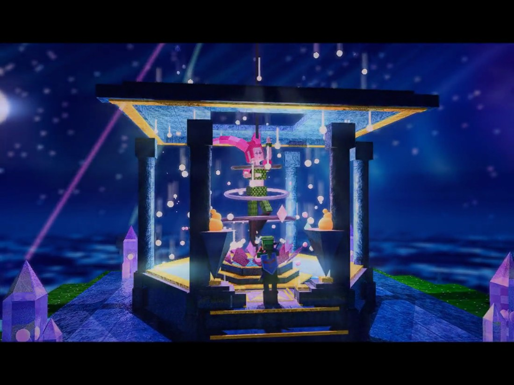
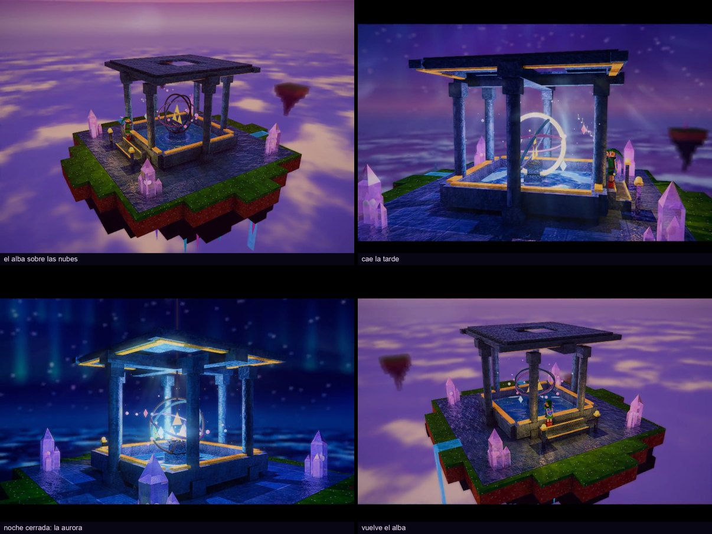
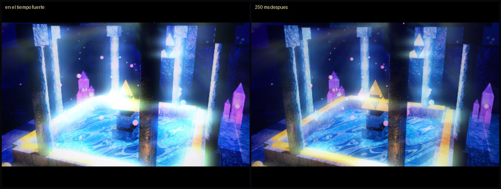
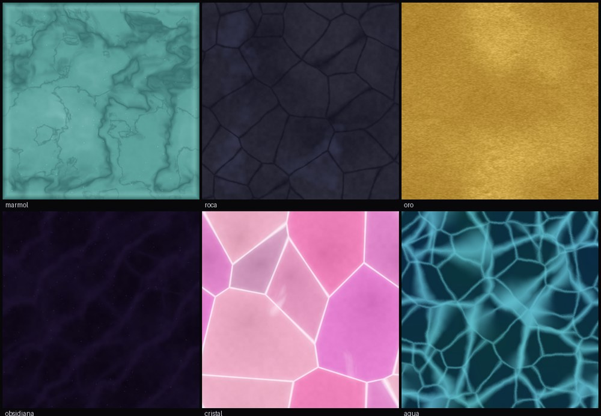

# Great Fairy Fountain — raytracer sincronizado con la música

Un trazador de rayos en tiempo real, escrito desde cero en Rust, que dibuja la
fuente de las hadas de *Ocarina of Time* y la anima con el **Great Fairy's
Fountain Theme**. No hay motor 3D: la geometría, la iluminación, las sombras,
los reflejos y el cielo son código propio. Lo único que aporta raylib es la
ventana, el audio y la capacidad de correr shaders de fragmentos.

Las únicas dependencias son `raylib` (ventana, entrada, audio, shaders),
`rayon` (repartir las filas entre hilos) e `image` (leer y escribir PNG).
Ni matemática de vectores, ni intersecciones, ni BVH, ni sombreado.



---

## Correrlo

Hace falta [Rust](https://rustup.rs). El mp3 y el análisis ya vienen en el repo.

```bash
cargo run --release
```

Tiene que correrse desde la raíz del proyecto: las rutas de las texturas, los
shaders y la música son relativas a ahí.

### Controles

| | |
|---|---|
| `espacio` | play / pausa |
| `←` `→` o `A` `D` | girar alrededor de la fuente |
| `↑` `↓` o `W` `S` | subir y bajar la cámara |
| `Q` `E` o `PgUp` `PgDn` | acercar y alejar |
| ratón | arrastrar para orbitar, rueda para acercar |
| `X` | antialiasing 2×2 (cuadruplica el costo) |
| `T` | antialiasing temporal (gratis, viene encendido) |
| `F` | guardar una foto del cuadro en pantalla |
| `H` | mostrar u ocultar la ayuda |

La cámara se balancea sola todo el tiempo; las teclas se le **suman** a ese
balanceo en vez de reemplazarlo.

### Otros modos

```bash
cargo run --release -- --foto 95      # traza ese segundo con todo el post-procesado y lo guarda
cargo run --release -- --bench        # mide cinco momentos y vuelca el trazado crudo
cargo run --release -- --sync 20      # imprime, segundo a segundo, lo que el análisis le pide a la escena
cargo run --release -- --taa          # banco de pruebas del antialiasing temporal
cargo run --release -- --sin-taa      # apagarlo, para compararlo
```

---

## El arco: empieza al amanecer y termina de noche



El tema abre con el cielo rosa y oro, el ambiente cálido, la bruma de la mañana
y la fuente apenas visible: todavía no puede competir con el cielo, y que no
compita es el punto. Sobre la mitad del tema el día se escurre —las estrellas
aparecen, el ambiente pasa de durazno a violeta, el sol se enfría hasta quedar
en luna— mientras las luces de la fuente **suben**. Es un fundido cruzado: la
fuente no cambia tanto de brillo como de protagonismo, y el clímax cae en
noche cerrada con la fuente siendo lo único que ilumina. Sobre la coda el
horizonte se vuelve a encender y engancha con el arranque, así que el loop es
un día entero por vuelta.

Todo eso cuelga de **un solo número**, `luz_del_dia`, que vale 1 al alba y 0 de
noche. De él salen la luz ambiente, el resplandor del cielo, el color y la
densidad de la niebla, el color y la potencia del sol/luna, cuánto brilla la
fuente, la fuerza del bloom y su umbral.

## El golpe



Las dos imágenes están separadas por un cuarto de segundo. En el tiempo fuerte
el cuadro tiene un 31 % más de luminancia y un 20 % más de contraste.

Conseguir eso costó descubrir dos cosas. La primera es que en el clímax la
imagen ya está apoyada contra el techo de la curva de tono, así que **un golpe
hecho de brillo no puede leerse**: el primer intento movía la luminancia media
un 2,2 %, por debajo del umbral perceptivo. Lo que sí se lee ahí es el
contraste y la saturación, que son relaciones entre tonos y la curva no
comprime. La segunda es que las luces estaban clavadas en su tope —el término
sostenido solo ya lo alcanzaba— así que había que recortarlo para dejarle sitio
al transitorio.

El golpe se arma con tres señales, porque ninguna sola alcanza en todo el tema:
el ataque detectado, la grilla de beats (lo único fiable entre el segundo 120 y
el 140, donde la música es un swell sostenido y genuinamente no hay ataques que
detectar) y el golpe del bajo.

---

## Cómo está hecho

### El trazado

- La aritmética de vectores es propia (`src/vec3.rs`): `Vec3`, producto
  punto, producto cruz, normalización y los operadores. Sin librería de
  álgebra lineal — en un trazador de rayos eso es justamente la parte que
  hay que mostrar.
- Cuboides, cilindros, planos recortados, esferas y triángulos.
- Materiales con textura, mapa de relieve, reflexión y refracción con
  **Fresnel** (aproximación de Schlick) y sombras translúcidas: el agua y el
  cristal dejan pasar parte de la luz, así que el fondo de la piscina se
  ilumina a través del agua.
- **Skybox equirectangular generado por código**: estrellas que titilan,
  nebulosa y luna, con el cielo girando a lo largo del tema.
- **BVH** construido con la heurística de área sobre grupos acotados por cajas
  alineadas a los ejes. El árbol de sombras va aparte y solo lleva lo que puede
  tapar la luz.
- Los rayos se podan por contribución acumulada, no por profundidad: un camino
  que ya no puede cambiar ni un nivel de 255 no se sigue.
- **Oclusión ambiental** con dos rayos por impacto en el hemisferio
  ponderado por el coseno. El largo máximo de cada rayo se sortea, y eso da
  la caída con la distancia gratis: la probabilidad de que un oclusor a
  distancia *d* bloquee un rayo es la probabilidad de que ese rayo haya
  salido más largo que *d*.
- **Reflejos rugosos**: el rayo reflejado se desvía según la rugosidad del
  material, y el acumulador temporal promedia. Un espejo perfecto es lo que
  sale gratis en un trazador y es justo lo que lo delata.
- **Antialiasing temporal** con reproyección y recorte de vecindad. Es lo
  que hace posibles los dos puntos anteriores: alcanza con un puñado de
  muestras por cuadro porque el acumulador promedia las de los últimos
  cuatro.

### El post-procesado (GLSL 330, en luz lineal)

- **Bloom por cadena de seis mips**, el método de *Call of Duty: Advanced
  Warfare*: filtro de 13 muestras al bajar, carpa de 3×3 al subir. El halo es
  la suma de seis escalas de desenfoque a la vez, así que tiene núcleo
  apretado y falda enorme.
- Curva de tono **AgX**, que sube al blanco sin torcer el tono de los colores
  saturados, que es todo el problema en una escena de rosas y cianes.
- Niebla cuadrática por profundidad, god rays, caleidoscopio enmascarado por
  profundidad.
- Profundidad de campo, estelas anamórficas, aberración cromática, viñeta,
  grano y cierre a formato ancho.
- **CAS** (realce adaptativo por contraste) para recuperar el filo que pierde
  el estirado de 400×300 a 800×600.

### La sincronización

`analizar_audio.py` saca bandas de frecuencia, onsets, beats, secciones y
chroma a 30 fps y los deja en un JSON. El trazador lo lee al arrancar y lo
indexa por tiempo; no sabe que existe librosa.

Las bandas pasan por un **seguidor de envolvente asimétrico** (ataque casi
instantáneo, caída lenta), que es lo que hace que el golpe entre entero y lo
que se suavice sea solo la cola.

### Las texturas



Procedurales, 512×512, generadas por `generar_texturas_cueva.py` con NumPy y
semilla fija. Mármol por el contorno cero de un ruido deformado (no por senos:
salían rayas parejas como corteza), roca y cristal por Voronoi, oro cepillado
y una red de cáusticas para el agua.

```bash
python3 generar_texturas_cueva.py            # regenerar las texturas
python3 analizar_audio.py assets/music/fairy_fountain.mp3 \
    --salida fairy_fountain_sync.json        # regenerar el análisis (pide librosa)
```

---

## Rendimiento

Medido en un MacBook Air M3, trazando a 400×300 y estirando a 800×600:

| | |
|---|---|
| Trazado, sin ventana ni audio | ~39 ms por cuadro (26 fps) |
| En vivo, con música y post-procesado | 15–22 fps |

La palanca grande es la resolución de trazado (`RENDER_W` / `RENDER_H` en
`src/main.rs`), no el post-procesado: el bloom, la niebla y el resto corren en
la GPU y cuestan casi lo mismo a cualquier resolución.

---

## Música

`assets/music/fairy_fountain.mp3` es el **Great Fairy's Fountain Theme** de
*The Legend of Zelda 25th Anniversary Soundtrack*. Los derechos son de
Nintendo; está acá solo para que el proyecto se pueda correr tal cual.

Si el archivo no está, la escena corre igual con un reloj interno.
